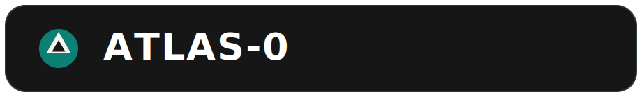
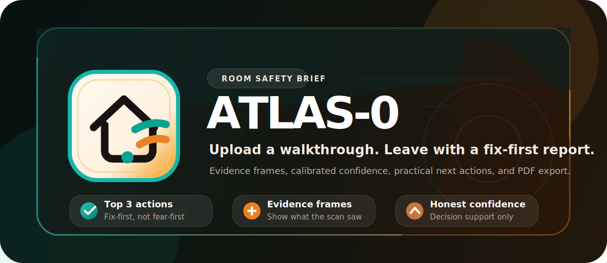

<p align="center">
  
</p>

<p align="center">
  
</p>

<p align="center">
  <a href="docs/DEVELOPMENT_PLAN.md">
    
  </a>
  <a href="docs/DEVELOPMENT_PLAN.md">
    
  </a>
  
  
  <a href="LICENSE">
    
  </a>
</p>

<p align="center"><strong>Scan your room. Catch what could fall, tip, or break.</strong></p>

ATLAS-0 is now being built as an upload-first room safety product, not a broad
"general spatial reasoning engine."

The current wedge is simple:

**Upload a 20-60 second phone walkthrough of a room and get back a hazard
report with top risks, evidence frames, approximate locations, confidence
signals, recommendations, and a downloadable PDF.**

## Current Standing

ATLAS-0 has real engineering underneath it, but it is still an early product.

What is strong today:
- Upload jobs persist to disk instead of living only in memory.
- Completed scans produce a report-first UI and a downloadable PDF.
- Findings now include evidence frames, hazard codes, reasoning signals, and
  deterministic recommendations.
- The report includes `Fix first` actions, scan-quality diagnostics, and
  user feedback hooks for `useful`, `wrong`, and `duplicate`.
- Rust, Python, and benchmark coverage are in good shape for this stage.

What is still rough:
- Upload-side 3D grounding is still approximate, not survey-grade.
- Multi-frame localization is better than before, but it is not full
  reconstruction.
- Some upload analysis remains heuristic, especially for difficult scans.
- This is still a self-hosted developer/beta build, not a polished hosted
  consumer product.

## What Atlas-0 Is Now

Atlas-0 is best thought of as:

- A **home or room safety scan** from a phone video
- A **report-first workflow** instead of a live demo-first workflow
- A **trust-improving system** that tries to show evidence and uncertainty,
  not fake certainty

Atlas-0 is not currently positioned as:

- a full digital twin platform
- a warehouse compliance suite
- a real-time AR product for everyday users
- a general-purpose reasoning agent

## What Works Today

The current product slice supports:

1. Uploading an image or room walkthrough video
2. Sampling frames and extracting salient regions
3. Labeling likely objects and estimating approximate multi-view positions
4. Generating hazard findings with:
   - severity
   - confidence
   - evidence frames
   - reasoning signals
   - actionable recommendations
5. Exporting a PDF report
6. Reviewing findings in a report-first frontend at `/app`

## Why Someone Would Use This

The core user value right now is not "AI 3D magic." It is:

- **Quick room triage**: surface the objects most likely to fall, tip, spill,
  or break
- **Actionable output**: tell the user what is wrong, why it matters, and what
  to do next
- **Shareable evidence**: give them a report they can send to a landlord,
  partner, contractor, or insurer

If ATLAS-0 becomes genuinely useful, it will be because it helps a person go
from "this room feels unsafe or cluttered" to "here are the 3 things I should
fix first."

## Known Limitations

This README is intentionally honest about the current state:

- Spatial positions are **estimated**, not measured with high precision.
- Upload reports should be treated as **decision support**, not professional
  safety certification.
- Weak scans still degrade results. Blur, darkness, short coverage, and low
  motion all reduce report quality.
- The scene view is secondary. The report is the product.

## Quick Start

### Prerequisites

- Rust toolchain
- Python 3.11+
- `uv` for Python environment management
- One VLM path:
  - local Ollama, or
  - OpenAI, or
  - Anthropic

### Install

```bash
git clone https://github.com/yashasviudayan-py/Atlas-0
cd Atlas-0

uv sync --extra dev --extra video
```

Optional provider extras:

```bash
uv sync --extra dev --extra video --extra openai
uv sync --extra dev --extra video --extra claude
```

If you want the default local path, start Ollama separately and make sure your
configured model is available.

### Run The Upload-First Product

For the current product wedge, the easiest path is API + web app:

```bash
uv run python scripts/run_atlas.py --no-slam
```

Then open:

```text
http://localhost:8420/app
```

This gives you the report-first frontend where you can upload a scan and review
the resulting hazard report.

### Run The Full Stack

If you want to run the experimental Rust SLAM path as well:

```bash
uv run python scripts/run_atlas.py
```

Useful variants:

```bash
uv run python scripts/run_atlas.py --dev
uv run python scripts/run_atlas.py --config configs/default.toml
uv run python scripts/run_atlas.py --no-api
```

## Core API Surface

| Method | Endpoint | Purpose |
|--------|----------|---------|
| `POST` | `/upload` | Upload an image or room walkthrough |
| `GET` | `/jobs` | List upload jobs |
| `GET` | `/jobs/{job_id}` | Fetch one job and its report payload |
| `POST` | `/jobs/{job_id}/feedback` | Mark a finding as useful, wrong, or duplicate |
| `GET` | `/reports/{job_id}.pdf` | Download the PDF report |
| `GET` | `/health` | Runtime health and status |
| `POST` | `/query` | Experimental spatial query interface |
| `GET` | `/objects` | Experimental object listing |
| `GET` | `/scene` | Experimental scene snapshot |
| `GET` | `/metrics` | Prometheus metrics |
| `WS` | `/ws/risks` | Experimental risk delta stream |

## Development

### Required Checks

Before pushing, this repo expects all of the following to pass:

```bash
cargo fmt --all -- --check
cargo clippy --all-targets -- -D warnings
cargo test --all
ruff check python/
ruff format --check python/
pytest python/tests/ -v
```

### Benchmarks

```bash
uv run python scripts/benchmark.py --skip-vlm
```

The benchmark suite includes the committed sample walkthrough report fixture so
the upload/report path can be checked for regressions.

## Repository Layout

```text
crates/            Rust crates for SLAM, physics, streaming, and shared core code
python/atlas/      Python API, VLM integration, world-model logic, utilities
frontend/          Report-first web UI
configs/           Runtime TOML configuration
scripts/           Process manager, benchmarks, and support scripts
docs/              Architecture docs and development plan
data/              Sample walkthrough fixtures and expected report output
tests/             Cross-language integration tests
```

## Roadmap

The active roadmap lives in [docs/DEVELOPMENT_PLAN.md](docs/DEVELOPMENT_PLAN.md).

The current order of attack is:

1. Keep the product honest
2. Improve upload grounding and reasoning quality
3. Make the report more useful than the visualization
4. Add enough onboarding, feedback, and product polish to support beta users

## License

MIT. See [LICENSE](LICENSE).
